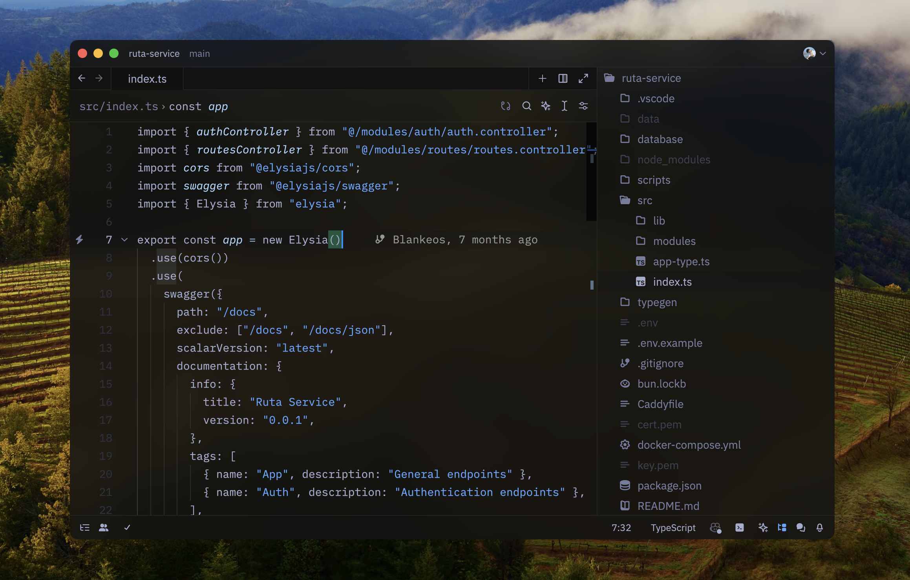

<p align="middle">
  
  <h3 align="middle">Blankeos Zen.zed</h3>
  <p align="middle">A minimal, dark, and frameless theme for VS Code. Based on poimandres.</p>
</p>

<div align="middle">


</div>



This theme contains:

- Blankeos Zen - a bluer poimandres.
- Blankeos Zen Dark (Blurred) - a blurred version of the above.
- Blankeos Zen Dark - a bluer poimandres but darker background.
- Blankeos Zen Dark (Blurred) - a blurred version of the above.

## Other tips

- I want transparent backgrounds instead of just blurred
  ```jsonc
  // settings.json
  {
    // Theme Overrides
    "experimental.theme_overrides": {
      "background.appearance": "transparent"
    }
  }
  ```

<br />

## Related

- [blankeos-zen](https://github.com/Blankeos/blankeos-zen-theme): VSCode version
